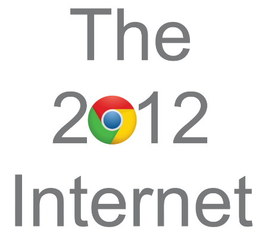

# 
Don't like the current internet? Why not wind things back to 2012 when it was simpler? It was a good point in the internet, simplification wasn't that too simplified, Google didn't make their logos into a metro style, and everyone was having a good time. This extention remakes the old 2012 internet into the browsers of today for everyone to see.
This extention is only available to me right now and is going to be available on GitHub and Google Drive when the first website is done.
